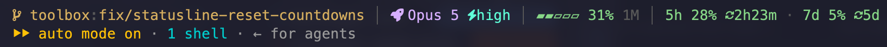

# Configuration

Reference for `.toolbox.yaml`: every supported key, the loading order, and the `TOOLBOX_*` environment overrides. Source of truth: `internal/config/config.go` (schema + validation) and `internal/configexample/render.go` (annotated template).

## Getting started

```bash
toolbox init             # write an annotated .toolbox.yaml in the current directory (--force to overwrite)
toolbox config example   # print the same annotated template to stdout
toolbox config show      # print the fully-resolved configuration (--origin annotates each key's layer)
toolbox config doctor    # validate without modifying
toolbox config ui        # interactively view/edit keys across the global & repo layers (needs a TTY)
```

Prefer not to hand-edit YAML? [`toolbox config ui`](commands.md#config-ui) is an interactive, provenance-first editor for every key below — it shows both the effective value and what each layer (global / repo) sets, and writes through the same validated, comment-preserving path as `config set`. The full `toolbox config` subcommand tree is documented in [commands](commands.md#toolbox-config).

## Loading order

Configuration is loaded from (highest priority first):

1. `--config` flag
2. The nearest `.toolbox.yaml` walking up from the current working directory (search stops at `$HOME` or the filesystem root) — running `toolbox shell` from any subdirectory of a workspace still picks up that workspace's project config
3. `~/.toolbox.yaml` (global)
4. `TOOLBOX_*` environment variables
5. Built-in defaults

## Key reference

| Key | Type | Default | Purpose |
|-----|------|---------|---------|
| [`mounts`](mounts.md#mounts-merge-semantics) | list | built-in defaults | Patch / replace / append / disable the default bind mounts by `name`. |
| [`mounts_root`](mounts.md#mounts_root-retarget) | string | `""` | Retarget every `~/.toolbox/`-managed default mount to a custom root. |
| [`inherit_host_auth`](#inherit-host-auth) | list | `[]` | Opt listed CLIs into the host's real credential path instead of the isolated default. |
| [`shells`](shells.md) | map | – | Named shell shortcuts: `<name>: {path, env}`. |
| [`shell`](#shell) | string | `zsh` | Login shell inside the container (only `zsh` is supported). |
| [`agent`](#agent) | string | `claude` | Default AI agent auto-launched by [`toolbox worktree`](commands.md#toolbox-worktree): `claude` or `codex`. |
| [`image`](#image-selection) | string | `""` | Full image ref override (pull-source concern). |
| [`registry_mirror`](#image-selection) | string | `""` | Swap only the registry host of the canonical ref. |
| [`pull`](#image-selection) | string | `auto` | Registry-sync policy: `auto` / `always` / `never`. |
| [`sdd`](sdd.md) | map | – | Per-repo Spec-Driven-Development skill packs (`gsd`, `bmad`, `openspec`). |
| [`bridge`](bridge.md) | bool | `true` | Mount the host bridge state dir (browser / editor / proximo forwarding). |
| [`browser_bridge`](#browser_bridge-deprecated) | bool | – | **Deprecated** alias of `bridge`. |
| [`proximo`](proximo.md) | bool | auto | `.test` reachability + CA trust; omitted = auto-detect (on iff proximo's CA exists on the host). |
| [`managed_statusline`](#managed_statusline) | bool | `true` | Image-owned Claude Code statusline, re-applied every shell start; `false` keeps your own. |
| [`env`](#env-passthrough) | map | – | Arbitrary env vars injected into the in-container shell. |
| [`worktree`](#worktree) | map | – | Tune `toolbox worktree` sessions; `seed` adds extra gitignored paths to carry into a new worktree. |

## `shell`

Login shell inside the container. Only `zsh` is supported (the default); `bash` is rejected at config load with an explicit migration hint (`config.ValidateShell`).

## `agent`

Default AI agent auto-launched by [`toolbox worktree`](commands.md#toolbox-worktree) sessions. Accepts `claude` or `codex` — the two agents baked into the canonical image (`config.ValidateAgent`). Resolved with precedence `--agent` flag > this key > the default `claude`, so the flag is optional once a default is set. Honouring the standard [loading order](#loading-order), it can be set globally (`~/.toolbox.yaml`) for a per-user default or per-directory (`.toolbox.yaml`) to pin a project to one agent.

Set it via `toolbox config set agent <value>` ([`--where`](commands.md#--where-targeting) selects global vs local). The key has no default written to disk: when unset it resolves to `claude` at launch and `config show` omits it. A non-canonical `image:` lacking the chosen agent fails at launch, not at validation.

## `managed_statusline`

The runtime image ships a curated Claude Code statusline and applies it to every container by force-setting `~/.claude/settings.json` `statusLine` on each shell start (only that key is rewritten — everything else in your settings is preserved). It is image-owned policy: a local edit to the statusline is overwritten on the next shell, so **change it via a PR to this repo**, not in the container.



Set `managed_statusline: false` to opt out — the boot hook then leaves your own `statusLine` untouched. Default (omitted or `true`) is managed-on. Mechanics in [shell-start internals](internals/shell-start.md#managed-statusline).

## inherit-host-auth

`inherit_host_auth: [<key>, …]` in `.toolbox.yaml` opts the listed CLIs into reading the host's standard credential path instead of the isolated `~/.toolbox/<key>/` default. Default is `[]` — fully isolated, matches the pre-#276 behavior.

Eligible CLIs and their host paths (catalog entries with non-nil `HostAuthMount`):

| Key      | Host path                 | Container path                       |
|----------|---------------------------|--------------------------------------|
| `gh`     | `~/.config/gh`            | `/home/toolbox/.config/gh`           |
| `glab`   | `~/.config/glab-cli`      | `/home/toolbox/.config/glab-cli`     |
| `gcloud` | `~/.config/gcloud`        | `/home/toolbox/.config/gcloud`       |
| `docker` | `~/.docker`               | `/home/toolbox/.docker`              |
| `azure`  | `~/.azure`                | `/home/toolbox/.azure`               |
| `oci`    | `~/.oci`                  | `/home/toolbox/.oci`                 |
| `claude` | `~/.claude`               | `/home/toolbox/.claude`              |
| `codex`  | `~/.codex`                | `/home/toolbox/.codex`               |
| `atuin`  | `~/.local/share/atuin`    | `/home/toolbox/.local/share/atuin`   |

Validation in `config.Plan` rejects unknown keys and keys whose catalog entry lacks `HostAuthMount`.

Mount semantics: when a key is listed in `inherit_host_auth`, the default `~/.toolbox/<key>` mount is dropped (not supplemented) — two mounts at the same container target would shadow unpredictably. User `mounts:` patches keying on the same `name:` still compose on top of the inherited mount.

`mounts_root` interaction: if both `mounts_root: /custom` and `inherit_host_auth: [<key>]` are set, the `mounts_root` retargeting is bypassed for that key — host inheritance pulls from the host's canonical path (e.g. `~/.config/gh`), not from `/custom/gh`. `mounts_root` still applies to every other default mount. If you need the credential dir on an encrypted volume, choose one approach or the other.

Pre-stat check: `inherit_host_auth: [<key>]` requires the host source path to exist at config-load time. If it does not, `toolbox shell` fails with a clear error pointing at the missing path — silent soft-skip would have left the container with no credential mount at all (worse than failing loud).

Read-write inheritance: inherited mounts are read-write. Most listed CLIs refresh tokens or update session state during normal use (atuin appends history, claude/codex write session state, gh/docker rotate OAuth refresh tokens) — RO would EROFS those writes. You opt in explicitly: your host credential dir is now writable by container processes.

macOS keychain caveat: `gh` on macOS stores its OAuth token in the system keychain by default — `~/.config/gh/hosts.yml` carries the account but no `oauth_token`, so inheriting that dir mounts a token-less config and `gh auth status` inside the container reports the token invalid. Workaround: re-login on the host with `gh auth login --insecure-storage` (persists the token into `hosts.yml`), or skip inheritance for gh and log in once inside the container (isolated `~/.toolbox/gh` survives recreates). The same class of issue applies to any CLI that delegates secret storage to an OS keychain.

## Image selection

`toolbox shell` defaults to `ghcr.io/filippolmt/toolbox:latest`. There is no per-tool opt-out, no local-hash fallback, no auto-build branch. `toolbox build` is the explicit escape hatch — it overwrites the local cache of the canonical tag so the next `toolbox shell` picks up the freshly built image. Run `docker pull ghcr.io/filippolmt/toolbox:latest` to restore the upstream copy.

**Source relocation (opt-in).** The ref and pull behaviour are configurable — globally (`~/.toolbox.yaml`), per-repo (`.toolbox.yaml`), or via `TOOLBOX_*` env — for users who serve the image from a proxy hub / pull-through cache (Harbor, Artifactory, Nexus, ECR pull-through). `internal/build.ResolveImage(image, registryMirror)` owns the precedence, highest first:

- `image` — full ref override, used verbatim. Highest. Caveat: a local `toolbox build` tags the *canonical* ref, so with a full override `imageplan.Ensure` looks for the override ref and won't find the local build — `image` is a pull-source concern, not a build target.
- `registry_mirror` — swaps only the registry host of the canonical ref, preserving `filippolmt/toolbox:latest` (host split via `build.SplitRegistryHost`, shared with `imagepull.registryOf`). The relocated image is byte-identical, so a `registry_mirror` *does* satisfy `Ensure`. Caveat: a pull-through cache that hasn't ingested the image yet fails the first shell with `manifest unknown` — warm it (or pre-seed locally with `pull: never`), see [troubleshooting](troubleshooting.md#manifest-unknown-with-a-registry-mirror).
- neither — the canonical default.

The `pull` policy (`auto` default | `always` | `never`) steers `imageplan.Refresh`: `never` skips the registry round-trip entirely (air-gapped — `Ensure` still hard-requires the image locally), `always` forces a pull bypassing the 1 h TTL cache (`imagepull.ForcePull`), `auto` is the cache-aware default (`imagepull.RefreshIfStale`). Env override requires the keys to be viper-seeded (`SetDefault` in `config.Merge`) — `AutomaticEnv` only resolves `TOOLBOX_*` for keys it already knows. Edit via `toolbox config set --where global|local [--image|--registry-mirror|--pull]` (empty value resets the key).

### Local overlay Dockerfile

To layer your own tools onto the standard image without a repo change or a per-shell `init.d/` script, drop a `Dockerfile` at `~/.toolbox/Dockerfile` (retargeted with [`mounts_root`](mounts.md#mounts_root-retarget) / a profile root, same as every `~/.toolbox/`-managed path). Its presence is the sole opt-in — **global only**, no per-repo or config-key activation. When present, `toolbox shell` builds a derived image tagged `ghcr.io/filippolmt/toolbox:local` on top of the resolved base and runs from it; when absent, the shell runs from the base image unchanged.

**Append-only, RUN-only contract.** The overlay is a bare fragment — it MUST NOT contain a `FROM` line and builds with an **empty context** (no `COPY`/`ADD` from host files, so nothing under `~/.toolbox/` is ever tarred into the build). Toolbox injects `FROM <resolved base image ID>` ahead of your fragment, so entrypoint, `init.d/`, and host-UID mapping are inherited unchanged. Use it for `RUN sudo apt-get install …` / `RUN pip install …`-style additions:

```dockerfile
# ~/.toolbox/Dockerfile — no FROM line; RUN only.
RUN sudo apt-get update && sudo apt-get install -y --no-install-recommends \
      httpie \
    && sudo rm -rf /var/lib/apt/lists/*
```

**Rebuild triggers.** A marker (base image ID + `sha256` of the Dockerfile bytes) is stored under the toolbox state dir (`~/.toolbox/toolbox/state/local-overlay.marker`, mounts_root-aware — alongside the image-pull cache, so toolbox-managed state stays out of your config dir). The build is skipped when the marker matches **and** `:local` is present locally; otherwise it rebuilds. So a rebuild happens when you edit the Dockerfile, when `imageplan.Refresh` updates the base (its image ID changes), or when the `:local` image is missing. Base freshness stays governed by [`pull`](#image-selection); `:local` carries pull policy `never`, so `Refresh`/`Ensure` never reach a registry for it. The first build streams its output and is unavoidably slower; later shells skip via the marker.

**Fail-loud.** A failing overlay build (e.g. a broken `RUN`) aborts the shell and surfaces the build log — Toolbox never silently falls back to the base image.

**Next fresh container.** A rebuilt `:local` takes effect for the next freshly-created container under the existing [`AutoRemove`](internals/container-lifecycle.md#container-teardown) lifecycle. A running/stopped container is reused as-is and adopts the new image only when a fresh container is next created — `toolbox stop` (or exiting the shell) forces that. Rollback: delete `~/.toolbox/Dockerfile` (revert to base) or `docker rmi ghcr.io/filippolmt/toolbox:local`.

## `browser_bridge` (deprecated)

`browser_bridge:` is the pre-rename spelling of [`bridge:`](bridge.md). When `bridge:` is absent, the loader folds `browser_bridge` into it (`fillDefaultsBackstop` in `internal/config/config.go`); when both are set, `bridge:` wins. Migrate to `bridge:` — the alias survives only for config files written before the rename.

## `env:` passthrough

Arbitrary env vars injected into the in-container shell via an `env:` map in `.toolbox.yaml`. Motivating case: opt-in env-gated CLI features like `CLAUDE_CODE_WORKFLOWS=1` (Workflow tool), which previously needed a persisted `~/.zshrc` edit.

```yaml
env:                              # top-level — applies to every toolbox shell
  CLAUDE_CODE_WORKFLOWS: "1"
  CLAUDE_CODE_EFFORT_LEVEL: medium
  PROMPT_HIDE_KUBE: "1"           # hide the starship kubernetes segment

shells:
  infra:
    path: /tmp/infra
    env:                          # per-shell — overlays the top-level map
      AWS_PROFILE: prod
```

The `kubernetes` and `gcloud` prompt segments are opt-out via `PROMPT_HIDE_KUBE` / `PROMPT_HIDE_GCLOUD` (set to any value to hide). Details and why `terraform`/`docker_context` aren't env-toggleable: [prompt module toggles](internals/shell-start.md#prompt-module-toggles).

Contract:

- **Scope.** Resolved by the normal config load order (`--config` → walked-up `.toolbox.yaml` → `~/.toolbox.yaml` → `TOOLBOX_*` env → defaults), so the top-level `env:` is set globally (`~/.toolbox.yaml`) or per-project (`.toolbox.yaml`). The per-shell `shells.<name>.env` overlays it for that named shell only — per-shell keys win on collision (`config.Config.EffectiveEnv`, keyed by the *raw* `shells:` name, not the sanitized container suffix).
- **Emission order.** `sessionplan` emits the curated `TOOLBOX_*`/`PWD`/SDD entries first, then the loopback-bridge markers, then the user env sorted by key (`sessionplan.userEnv`, deterministic for tests).
- **Reserved keys.** `config.ValidateEnv` rejects empty keys, keys containing `=`, and any key with the `TOOLBOX_` prefix or the literal `PWD` — those are owned by the curated contract. Same rules apply per-entry under `shells.<name>.env` (errors namespaced as `shells.<name>.env: …`). Empty *values* are allowed (`export VAR=`).
- **Hash-neutral.** Lives outside the removed `tools:` block, like `sdd:` / `bridge:` — flipping a key never invalidates the image hash. Takes effect on the next container create (`toolbox stop` first to refresh an existing one).

## worktree

Tunes [`toolbox worktree`](commands.md#toolbox-worktree) sessions. A worktree is a checkout of git-tracked files only, so `create`/`open` seed a curated set of gitignored per-repo working state from the main repo into the new worktree (`.claude/settings.local.json`, `.env`/`.env.*`, `openspec/`, gsd's `.planning/`). `worktree.seed` adds extra repo-relative paths to that set:

```yaml
worktree:
  seed:
    - .secrets.local
    - config/local.yaml
```

Contract:

- **Gitignore-gated.** Every candidate — built-in defaults and `seed` entries alike — is copied **only if `git check-ignore` reports it ignored** in the main repo. A tracked path already arrives with the checkout; a non-ignored untracked path is left alone. So a `seed` entry that isn't gitignored is a silent no-op, and the built-in defaults self-correct in a repo that tracks one of them.
- **Additive.** `seed` is unioned with the built-in defaults (not a replacement); directories are copied recursively. Copies never clobber a worktree-local edit (an existing destination is kept).
- **Validation.** `config.ValidateWorktreeSeed` rejects absolute paths, entries containing `..`, and empty strings — the paths drive filesystem reads under the repo root and writes under the worktree, so traversal must not escape either tree.

## `TOOLBOX_*` environment variables

Viper is configured with `SetEnvPrefix("TOOLBOX")` + `AutomaticEnv`, with the image-selection keys explicitly seeded so the override always resolves:

| Variable | Overrides |
|----------|-----------|
| `TOOLBOX_IMAGE` | `image` |
| `TOOLBOX_REGISTRY_MIRROR` | `registry_mirror` |
| `TOOLBOX_PULL` | `pull` |
| `TOOLBOX_BRIDGE` | `bridge` |

Env vars sit between the global file and built-in defaults in the [loading order](#loading-order): any file that sets the key wins over the env var.
